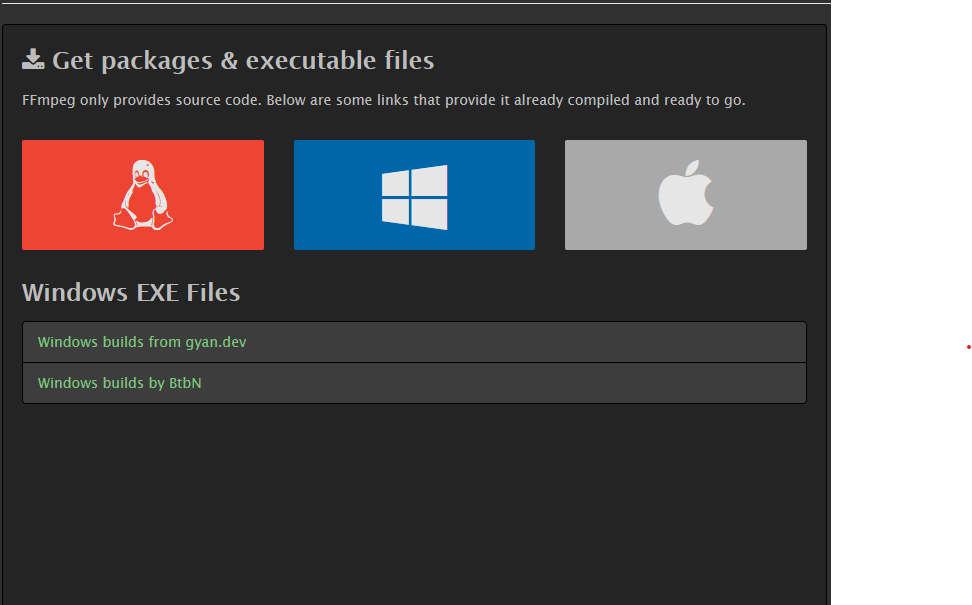
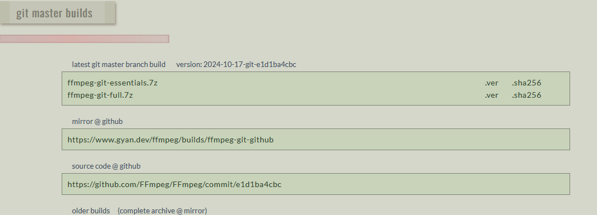
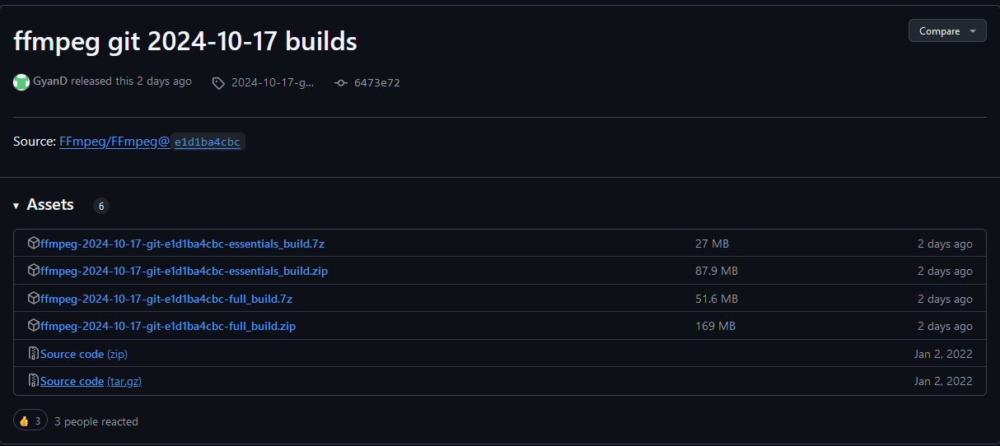
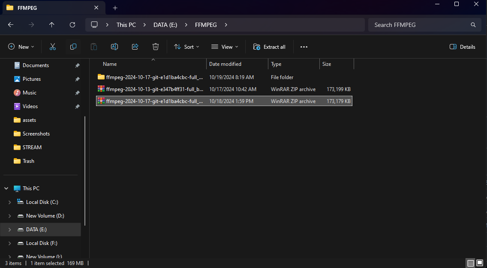
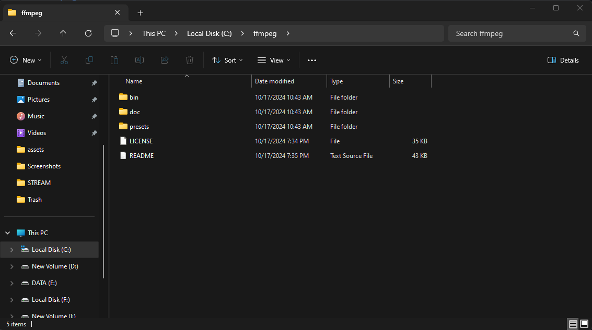
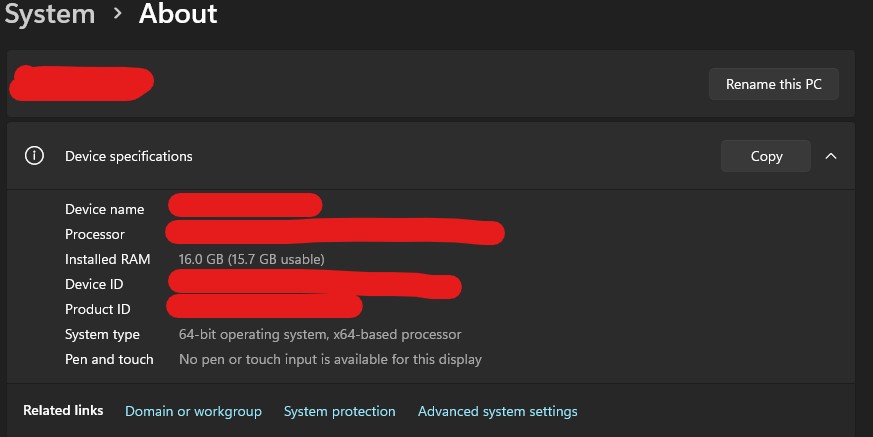
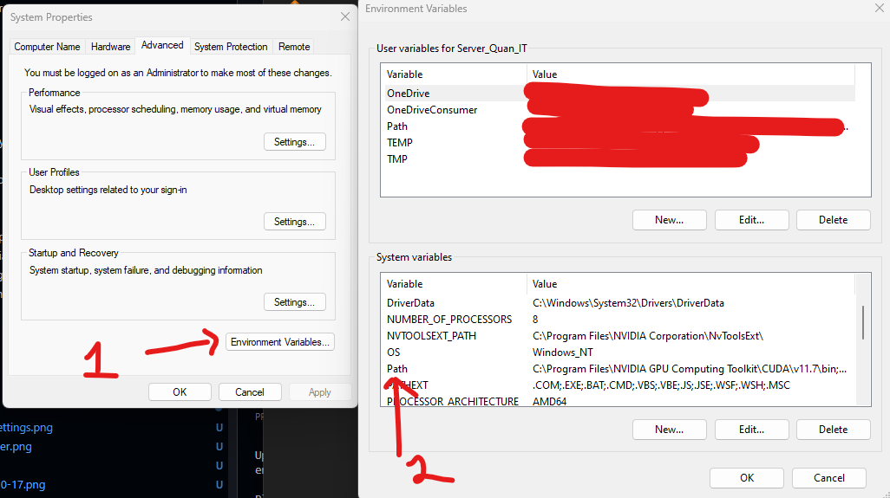
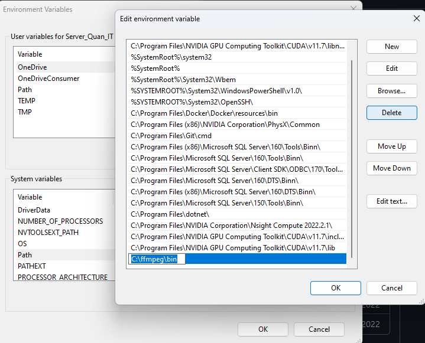
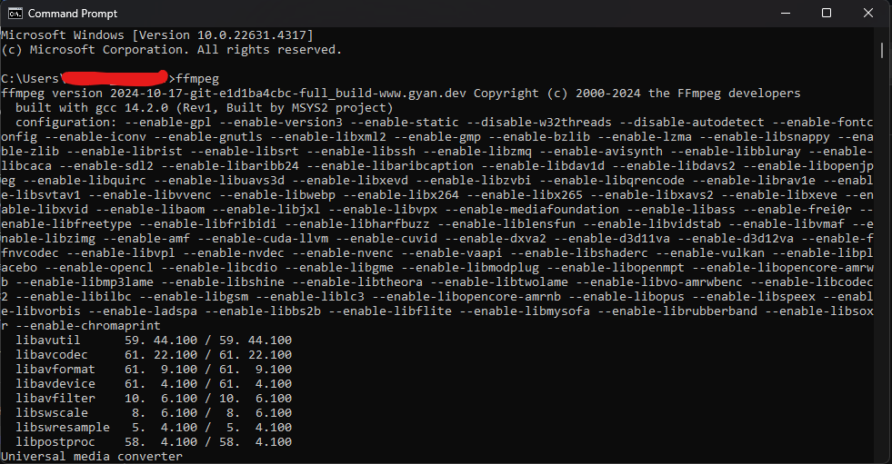

# Sử dụng phần mềm FFMPEG để kết nối và xem camera thông qua đường link rtsp  

# Mục lục

[I. FFMPEG](#i-FFMPEG)
- [1. Cài đặt ffmpeg từ trang chủ](#1-cài-đặt-ffmpeg-từ-trang-chủ)
- [2. Giải nén và đổi tên](#2-giải-nén-và-đổi-tên)
- [3. Di chuyển thư mục vào ổ C](#3-Di-chuyển-thư-mục-vào-ổ-C)
- [4. Đặt PATH cho FFMPEG](#4-Đặt-PATH-cho-FFMPEG)

[II. Cách sử dụng](#ii-cách-sử-dụng)
- [1. Sử dụng bằng cách gọi trực tiếp ffmpeg](#1-Sử-dụng-bằng-cách-gọi-trực-tiếp-ffmpeg)
  - [1. Tiêu đề - Heading](#1-tiêu-đề---heading)
  - [2. Đoạn văn - Paragraph](#2-đoạn-văn---paragraph)
  - [3. Chữ in nghiêng - Italic](#3-chữ-in-nghiêng---italic)
  - [4. Chữ in đậm - Bold](#4-chữ-in-đậm---bold)
  - [5. In đậm và in nghiêng](#5-in-đậm-và-in-nghiêng)


# I. FFMPEG

## 1. Cài đặt ffmpeg từ trang chủ
Vào trang chủ `ffmpeg` để tải về file nén của phần mềm [Tại Đây](https://ffmpeg.org/download.html)  



Chọn `Windows builds from gyan.dev`  

  

Sau đó chọn vào `mirror @ github` để đi đến nơi lưu trữ các file cài đặt mới nhất của `FFMPEG`  

  

Tải về phiên bản mới nhất với tên `full_build.zip` hoặc `full_build.7z`  

## 2. Giải nén và đổi tên 

Giải nén file mới nhất  

  

Sau đó đổi tên thư mục thành `ffmpeg`, bên trong thư mục sẽ có các thư mục bao gồm `bin`, `doc`, `presets`, `LICENSE`, `README`  

  

## 3. Di chuyển thư mục vào ổ C

Sau khi đổi tên thì di chuyển thư mục đó vào ổ C  

  

## 4. Đặt PATH cho FFMPEG

Cuối cùng là đặt đường dẫn thư mục `bin` của `FFMPEG` vào biến môi trường  
Vào `Setting` chọn `About` sau đó chọn `Advance system settings` để cài đặt biến môi trường  

  

Sau đó chọn `Enviroment Variables`, sẽ hiển thị ra bảng Enviroment Variables rồi tiếp tục chọn `Path` ở `system variables`  

  

Ở đây sẽ chọn `New` và ấn vào `Browse` và tìm đến đường dẫn `bin` của `FFMPEG` trong ổ C  

  

Cuối cùng để kiểm tra xem đã cài đặt thành công `FFMPEG` chưa thì ta mở `Command Prompt` và gõ lệnh:  
```
ffmpeg
```
  

Như trên hình ảnh hiển thì thì nó đã có version `2024-10-17-git ...` là đã cài đặt thành công  

# II. Cách sử dụng  

## 1. Sử dụng bằng cách gọi trực tiếp ffmpeg  

Để xem hình ảnh từ camera thì ta sử dụng phần mềm `ffmpeg`, khởi động phần mềm `ffmpeg` và đưa vào cho nó các thông số yêu cầu để chạy thông qua `python: 

```python

# Thay đổi kích thước các khung hình từ camera
target_width = 640  # Kích thước mới (ví dụ 640x360)
target_height = 360

# Các loại thông báo lỗi trong ffmpeg:
# `quiet`: ko thông báo, `panic`: hiển thị thông báo nghêm trọng nhất, `fatal`: hiển thị thông báo nghiêm trọng,
# `error`: thông báo lỗi, `warning`, `infor`, `verbose`: hiển thị nhiều thông tin chi tiết hơn, `debug`
command_video = [
    'ffmpeg', # Nếu đã cài đặt path từ bước 1 thì chỉ cần gọi ffmpeg, nếu không sẽ phải gõ đầy đủ đường link: C:/ffmpeg/bin/ffmpeg.exe
    '-loglevel', 'quiet',    # Tắt log, nếu cần thông tin từ log thì bỏ dòng này
    '-use_wallclock_as_timestamps', '1',  # Sử dụng thời gian thực cho dấu thời gian
    '-err_detect', 'ignore_err',  # Bỏ qua các lỗi dấu thời gian không hợp lệ
    '-rtsp_transport', 'tcp', # Phương thức truyền tải là TCP
    '-i', in_stream, # Đầu vào instream là đường link rtsp của camera, ví dụ: in_stream = 'rtsp://192.168.0.122:554/1/stream1/Profile1'
    '-vf', f'scale={target_width}:{target_height}',  # Thay đổi kích thước video cho phù hợp với mong muốn
    '-f', 'rawvideo',  # định dạng video sẽ là video gốc
    '-pix_fmt', 'bgr24', # định dạng màu là brg
    '-an', 'pipe:' # Cái này không biết
]

# Khởi chạy FFmpeg và đọc từ stdout
ffmpeg_process = subprocess.Popen(command, stdout=subprocess.PIPE)
```
Ví dụ cụ thể xem tại thư mục [Ví dụ](./Ví%20dụ/)
