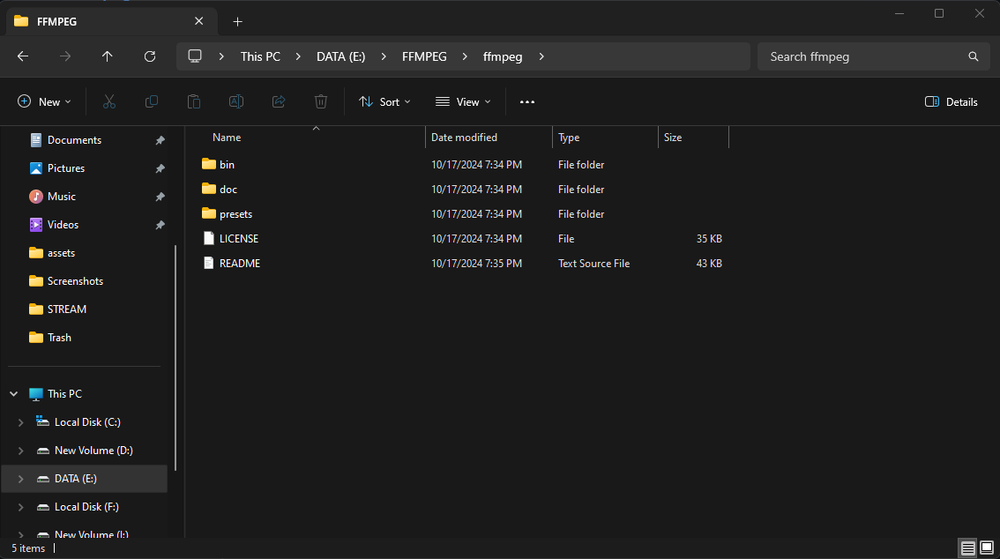

# work_with_camera_ethernet
## Sử dụng phần mềm FFMPEG để kết nối và xem camera thông qua đường link rtsp  

# Mục lục
[I. FFMPEG](#i-FFMPEG)
- [1. Cài đặt ffmpeg từ trang chủ](#1-cài-đặt-ffmpeg-từ-trang-chủ)
- [2. Giải nén và đổi tên](#2-giải-nén-và-đổi-tên)
- [3. Di chuyển thư mục vào ổ C](#3-Di-chuyển-thư-mục-vào-ổ-C)
- [4. Đặt PATH cho FFMPEG](#4-Đặt-PATH-cho-FFMPEG)

# I. FFMPEG

## 1. Cài đặt ffmpeg từ trang chủ
Vào trang chủ `ffmpeg` để tải về file nén của phần mềm [Tại Đây](https://ffmpeg.org/download.html)  


Chọn `Windows builds from gyan.dev`  

  

Sau đó chọn vào `mirror @ github` để đi đến nơi lưu trữ các file cài đặt mới nhất của `FFMPEG`  

  

Tải về phiên bản mới nhất với tên `full_build.zip` hoặc `full_build.7z`  

## 2. Giải nén và đổi tên 

Giải nén file mới nhất  

  

Sau đó đổi tên thư mục thành `ffmpeg`, bên trong thư mục sẽ có các thư mục bao gồm `bin`, `doc`, `presets`, `LICENSE`, `README`  

  

## 3. Di chuyển thư mục vào ổ C

Sau khi đổi tên thì di chuyển thư mục đó vào ổ C  

  

## 4. Đặt PATH cho FFMPEG

Cuối cùng là đặt đường dẫn thư mục `bin` của `FFMPEG` vào biến môi trường  
Vào `Setting` chọn `About` sau đó chọn `Advance system settings` để cài đặt biến môi trường  

  

Sau đó chọn `Enviroment Variables`, sẽ hiển thị ra bảng Enviroment Variables rồi tiếp tục chọn `Path` ở `system variables`  

  

Ở đây sẽ chọn `New` và ấn vào `Browse` và tìm đến đường dẫn `bin` của `FFMPEG` trong ổ C  

  

Cuối cùng để kiểm tra xem đã cài đặt thành công `FFMPEG` chưa thì ta mở `Command Prompt` và gõ lệnh:  
```
ffmpeg
```
  

Như trên hình ảnh hiển thì thì nó đã có version `2024-10-17-git ...` là đã cài đặt thành công  