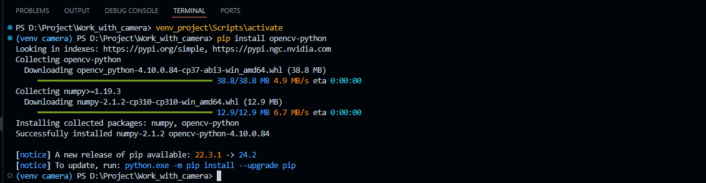
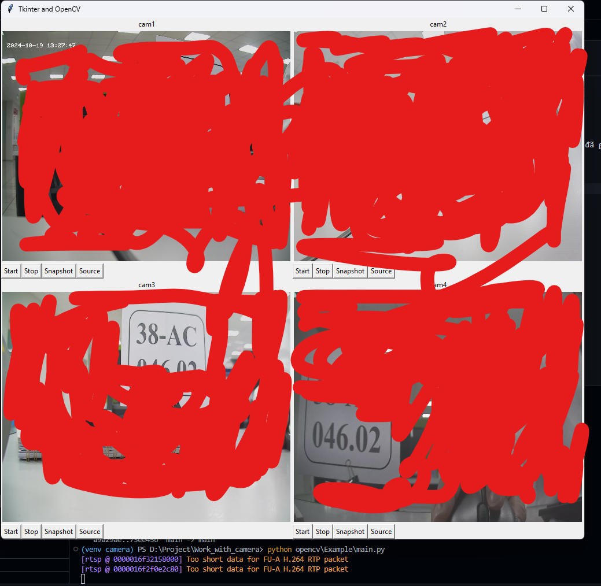

# Sử dụng thư viện opencv để kết nối và xem camera thông qua đường link rtsp  

# Mục lục

[I. Opencv](#i-Opencv)
- [1. Cài đặt opencv bằng pip](#1-cài-đặt-opencv-bằng-pip)

[II. Cách sử dụng](#ii-cách-sử-dụng)
- [1. Giải thích ban đầu](#1-Giải-thích-ban-đầu)

- [2. Sử dụng vào thực tế](#2-Sử-dụng-vào-thực-tế)

[III. Ví dụ](#iii-Ví-dụ)

# I. Opencv

## 1. Cài đặt opencv bằng pip  
Truy cập trang chủ `opencv` trên [Pypi](https://pypi.org/project/opencv-python/) hoặc [Github](https://github.com/opencv/opencv-python)  
Cài đặt đơn giản `opencv` nhất là sử dụng `pip`. Mở dự án, kích hoạt môi trường ảo và chạy câu lệnh sau bằng terminal: 

```python
pip install opencv-python
```


Như vậy là đã cài đặt thành công `opencv`  

# II. Cách sử dụng  

## 1. Giải thích ban đầu  

Thư viện `opencv` có một câu lệnh rất hữu ích, đó là `cv2.VideoCapture(rsp_link)`, chỉ cần đưa đường link rtsp làm tham số cho hàm này thì `opencv` sẽ kết nối đến với camera, sau đó để lấy các khung hình từ camera thì ta sử dụng lệnh `cv2.read`.  
Tuy nhiên lệnh `cv2.read` là một *hàm chặn*, các câu lệnh sau nó phải đợi nó hoàn thành đã thì mới tiếp tục thao tiếp tiếp, nếu trong quá trình lấy khung hình từ camera mà lỗi thì cả chương trình sẽ bị đóng, vì vậy ta cần xử lý tốt ở đoạn này. Cách xử lý phải bắt các trường hợp có thể xảy ra để xử lý các trường hợp lỗi đó:  
```python

vid = cv2.VideoCapture(self.video_source)
vid.set(cv2.CAP_PROP_BUFFERSIZE, 2)
# self.vid.set(cv2.CAP_PROP_FPS, 15)

if not vid.isOpened():
    print("Không thể kết nối tới camera)
    camera_connected = False
else:
    print("Đã kết nối tới camera")
    camera_connected = True

count = 0
while camera_connected: 
    try:
        ret, frame = vid.read()
        if not ret:
            print("Không thể lấy khung hình từ camera")
            frame = None
            ret = False
            count += 1

            # Sau 4 lần thử lại mà vẫn không được thì ngắt kết nối tới camera
            if count == 3 :
                camera_connected = False
                frame = disconnected_camera_image
                ret = True
            time.sleep(5)  # Thử lại sau 5s

    except cv2.error as e:
        print('OpenCV ERROR: %s', str(e))
        break  # Thoát vòng lặp nếu gặp ngoại lệ

    except Exception as e:
        print('Lỗi không xác định: %s', str(e))
```
Để có thể xử lý tốt các trường hợp có thể xảy ra trong việc đọc khung hình thì ta sử dụng `try-except` là phương án tốt nhất.  
Khi lấy khung hình từ câu lệnh `vid.read()` sẽ trả về 2 tham số là:  

> ret: True (Tức là lấy được hình ảnh thành công)/ False (Tức là lấy khunh hình từ camera lỗi)  
> frame: Nếu *ret* trả về là *True* thì frame này là một khung hình ngay lúc lấy (là một ma trận chứa các con số), còn nếu *ret* trả về *False* thì frame là *None*  

Vì vậy ta cần kiểm tra kỹ càng giá trị `ret` trả về và xử lý tương ứng, như đoạn code trên thì nếu như ta kết nối được tới camera thì ta sẽ cho một `cờ (flag) để duy trì quá trình đọc khung hình từ camera` có tên là `camera_connected`, và chạy vòng lặp `while` để liên tục lấy các khung hình từ camera. Mỗi lần lấy khung hình từ camera thì ta đều **phải kiểm tra *ret*** rồi mới xử lý tiếp. Nếu `ret` mà trả về `False` thì có nghĩa là có lỗi với camera, ta cần cố gắng thửu lấy lại khung hình thêm 4 lần nữa, nếu sau 4 lần thử lại mà vẫn lỗi thì cần đóng vòng lặp `while` để không làm tiêu tốn bộ nhớ.  

## 2. Sử dụng vào thực tế

Bởi vì `cv2.read` là một *hàm chặn* nên ta phải đưa nó vào một *luồng* riêng, luồng này sẽ đảm nhận việc liên tục lấy các khung hình từ camera:  

```python
def process(self):        
    while self.camera_connected:
        try:
            self.ret, self.frame = self.vid.read()
            if not self.ret:
                logger.error('%s %s', language_system.get_text("camera.error_read_frame"), self.video_source)
                self.frame = None
                self.ret = False
                self.count += 1

                # Sau 4 lần thử lại mà vẫn không được thì ngắt kết nối tới camera
                if self.count == 3 :
                    self.camera_connected = False
                    self.frame = self.disconnected_camera
                    self.ret = True
                time.sleep(5)  # Thử lại sau 5s

        except cv2.error as e:
            logger.exception('OpenCV ERROR: %s', str(e))
            break  # Thoát vòng lặp nếu gặp ngoại lệ

        except Exception as e:
            logger.exception('Lỗi không xác định: %s', str(e))

self.thread_open_camera = threading.Thread(target=self.process)
self.thread_open_camera.daemon = True
self.thread_open_camera.start()
```

# III. Ví dụ

Để chạy ví dụ mẫu, vui lòng clone toàn bộ cấu trúc thư mục `opencv` để có thể hoạt dộng đúng với đường dẫn đã ghi trong code.  
Sau đó kích hoạt môi trường ảo (nếu có) và chạy lệnh:  

```python
python opencv\Example\main.py
```

Ví dụ cụ thể xem tại thư mục [Ví dụ](./Example/)